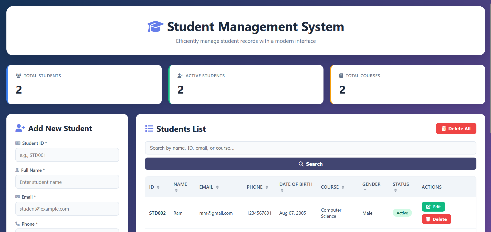
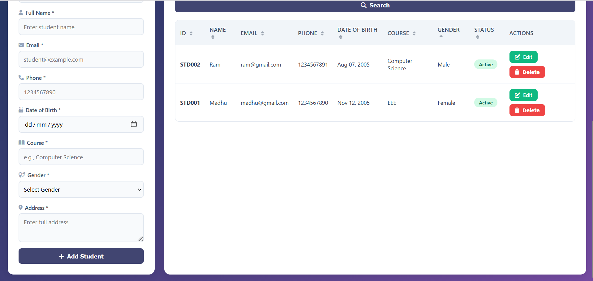

🎓 Student Management System

A simple and responsive web-based system to manage student records using PHP and MySQL. Supports full CRUD operations, searching, sorting, and a modern user interface.

✅ Features

- Add, edit, and delete student records  
- Bulk delete all students  
- Search and filter by name, ID, email, or course  
- Sort by any column with toggle sorting  
- Dashboard with student statistics  
- Responsive design for all devices  
- Input validation (email, date, required fields)  
- Secure database operations (PDO with prepared statements)  

🛠️ Tech Stack

- Backend: PHP 7.4+  
- Database: MySQL 5.7+  
- Frontend: HTML5, CSS3, JavaScript  
- Icons: Font Awesome  
- Web Server: Apache/Nginx (XAMPP/WAMP recommended)  

🚀 Setup Instructions

1. Clone the repo
git clone https://github.com/YOUR-USERNAME/student-management-system.git
cd student-management-system

2. Create the database
sql

CREATE DATABASE student_db;
USE student_db;

CREATE TABLE students (
  id INT AUTO_INCREMENT PRIMARY KEY,
  student_id VARCHAR(50) UNIQUE NOT NULL,
  name VARCHAR(100) NOT NULL,
  email VARCHAR(100) NOT NULL,
  phone VARCHAR(20) NOT NULL,
  course VARCHAR(100) NOT NULL,
  gender ENUM('Male', 'Female', 'Other') NOT NULL,
  dob DATE NOT NULL,
  address TEXT NOT NULL,
  status ENUM('Active', 'Inactive') DEFAULT 'Active',
  created_at TIMESTAMP DEFAULT CURRENT_TIMESTAMP
);

3. Configure database in `config.php`

<?php
$servername = "localhost";
$username = "your_username";
$password = "your_password";
$database = "student_db";
?>

4. Run the project
- Place it in your **htdocs** (XAMPP) or **www** folder (WAMP).  
- Start Apache and MySQL.  
- Open browser and go to:  
  👉 [http://localhost/student-management-system](http://localhost/student-management-system)

📸 Screenshots
  
